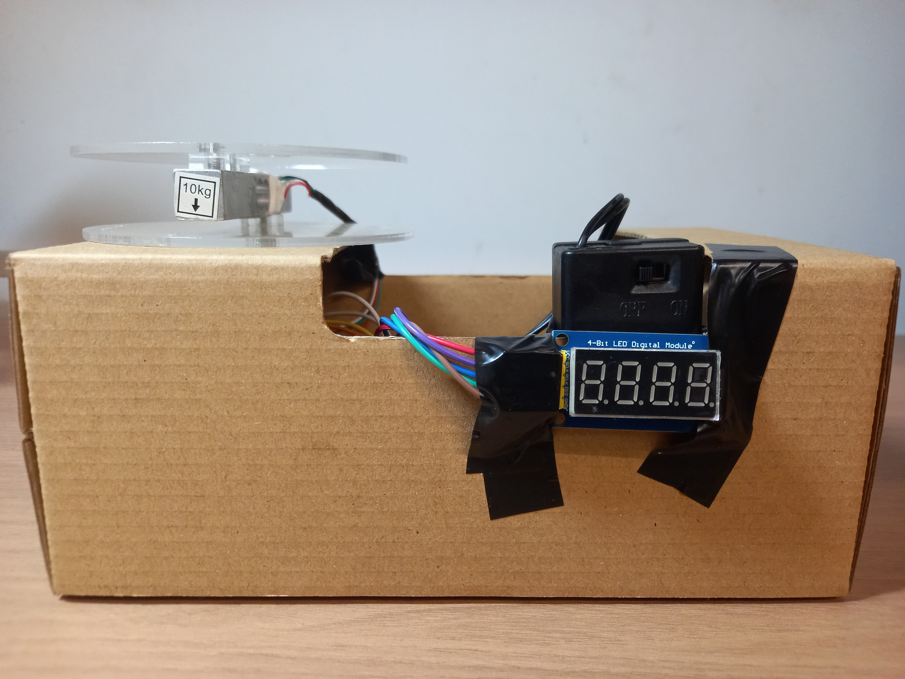

<h1 align="center">Digital Weigh Scale — Project Report</h1>

<p align="center">
  <b>Course:</b> Electrical Instrumentation and Measurement (ECE2024) <br>
  <b>Instructor:</b> Dr. Vo Bich Hien
</p>

<p align="center">
  <b>Authors:</b><br>
  Nguyen Hoang Long — ID: 10223088<br>
  Vu Hoang Minh — ID: 102240574
</p>

---

## Table of Contents
- [Abstract](#abstract)
- [1. Introduction](#1-introduction)
- [2. System Overview](#2-system-overview)
  - [2.1 Functional Block Diagram](#21-functional-block-diagram)
  - [2.2 Key Functions](#22-key-functions)
- [3. Theory of Operation](#3-theory-of-operation)
  - [3.1 Load Cell (Wheatstone Bridge)](#31-load-cell-wheatstone-bridge)
  - [3.2 HX711 24-bit ADC + PGA](#32-hx711-24-bit-adc--pga)
  - [3.3 4-Digit Display via 74HC595](#33-4-digit-display-via-74hc595)
- [4. Hardware Design](#4-hardware-design)
  - [4.1 Bill of Materials](#41-bill-of-materials)
  - [4.2 Wiring / Pin Mapping](#42-wiring--pin-mapping)
  - [4.3 Schematic](#43-schematic)
  - [4.4 Mechanical Construction](#44-mechanical-construction)
- [5. Firmware Implementation](#5-firmware-implementation)
  - [5.1 Libraries](#51-libraries)
  - [5.2 Main Loop (Sampling + Display)](#52-main-loop-sampling--display)
  - [5.3 Tare and Calibration](#53-tare-and-calibration)
  - [5.4 Display Limits](#54-display-limits)
- [6. Testing and Results](#6-testing-and-results)
- [7. Discussion, Limitations, and Improvements](#7-discussion-limitations-and-improvements)
- [8. Conclusion](#8-conclusion)
- [Appendix A — Serial Command Reference](#appendix-a--serial-command-reference)
- [Appendix B — Repository Structure](#appendix-b--repository-structure)
- [License](#license)

---

## Abstract

This project implements a low-cost **digital weigh scale** using an **Arduino Uno**, a **strain-gauge load cell**, and the **HX711 24-bit ADC** (with integrated programmable gain amplifier) for precision measurement. The weight is displayed in real time on a **4-digit 7-segment LED module** driven through **74HC595 shift registers**, and the measurement value is also streamed to the Serial Monitor. The firmware supports **tare (zeroing)** and **calibration** via serial commands, allowing the system to be adapted to the mechanical platform and sensor characteristics.

---

## 1. Introduction

Digital weighing systems are widely used in retail, industrial automation, and laboratories. A common approach is to use a **load cell** (strain-gauge bridge) that converts force into a small differential voltage, then digitize it using a high-resolution ADC such as the **HX711**. The Arduino processes the readings and drives a numeric display.

This mini project focuses on:
- interfacing a load cell sensor,
- precision ADC sampling using the HX711,
- real-time numeric display using a multiplexed 7-segment module,
- implementing tare and calibration procedures.

<p align="center">
  
  <br><i>Figure 1. Overall prototype (platform + enclosure + display).</i>
</p>

---

## 2. System Overview

### 2.1 Functional Block Diagram

```
Force / Weight
|
▼
Load Cell (Wheatstone Bridge)
| (mV/V differential signal)
▼
HX711 24-bit ADC + PGA
| (digital data)
▼
Arduino Uno (processing, tare, calibration)
|------------------> Serial Monitor (g=<value>, commands)
▼
4-Digit 7-Segment Display (74HC595 shift registers)
```


### 2.2 Key Functions

- Continuous weight measurement in **grams** (rounded to integer).
- Display output on a 4-digit module (supports **0–9999 g**).
- Serial streaming (`g=<value>`) for debugging/verification.
- Serial commands:
  - `t` → tare
  - `c <grams>` → calibrate using a known mass

---

## 3. Theory of Operation

### 3.1 Load Cell (Wheatstone Bridge)

A typical bar-type load cell contains strain gauges configured as a **Wheatstone bridge**. When force is applied, the bridge becomes unbalanced, producing a small differential output voltage (often only millivolts). This signal is too small to measure accurately using the Arduino’s built-in ADC without amplification.

### 3.2 HX711 24-bit ADC + PGA

The HX711 is designed for weigh scales and provides:
- a low-noise **PGA** (to amplify the bridge signal),
- a **24-bit ADC** to digitize the amplified signal,
- a simple two-wire interface: **DOUT (DT)** and **SCK**.

### 3.3 4-Digit Display via 74HC595

The 4-digit 7-segment display is driven through **74HC595 shift registers**, which reduces the Arduino I/O requirement to three lines:
- Data (DIO)
- Shift clock (SCLK)
- Latch clock (RCLK)

The display is refreshed continuously in software (multiplexing).

---

## 4. Hardware Design

### 4.1 Bill of Materials

- Arduino Uno (or compatible board)
- Load cell (prototype uses a bar-type load cell; label shows **10 kg** capacity on the platform)
- HX711 load cell amplifier/ADC module
- 4-digit 7-segment LED module (74HC595-based)
- Wires, fasteners, platform plates (acrylic), enclosure (cardboard)

<p align="center">
  
  <br><i>Figure 2. Front view (4-digit display and platform).</i>
</p>

### 4.2 Wiring / Pin Mapping

The firmware uses the following constructor mappings:

- `HX711_ADC LoadCell(A0, A1);`  → **DOUT = A0**, **SCK = A1**
- `Led4digit74HC595 disp(A5, A4, A3);` → **SCLK = A5**, **RCLK = A4**, **DIO = A3**

| Module         | Signal    | Arduino Pin |
|----------------|-----------|------------:|
| HX711          | DOUT (DT) | A0          |
| HX711          | SCK       | A1          |
| 4-digit display| DIO       | A3          |
| 4-digit display| RCLK      | A4          |
| 4-digit display| SCLK      | A5          |
| HX711          | VCC       | 3.3V        |
| 4-digit display| VCC       | 5V          |
| All modules    | GND       | GND         |


> **Note:** Load cell wire colors can vary by manufacturer. Many common load cells use:
> - Red = E+, Black = E-, Green = A+, White = A-  
> Always confirm using the markings on your load cell/HX711 board.

### 4.3 Schematic

<p align="center">
  
  <br><i>Figure 3. Wiring schematic for Arduino Uno + HX711 + 4-digit display.</i>
</p>

### 4.4 Mechanical Construction

The platform is assembled using acrylic plates and a bar-type load cell mounted between them. The HX711 module is placed near the load cell to reduce signal wiring length. The enclosure houses the Arduino and power wiring.

<p align="center">
  
  <br><i>Figure 4. Load cell assembly (side view) and HX711 placement.</i>
</p>

<p align="center">
  
  <br><i>Figure 5. Load cell assembly (top view) with wiring routed to the HX711.</i>
</p>

<p align="center">
  
  <br><i>Figure 6. Internal view showing Arduino placement and wiring.</i>
</p>

---

## 5. Firmware Implementation

Source file: [`Source Code/digital_weigh_scale.ino`](Source%20Code/digital_weigh_scale.ino)

### 5.1 Libraries

- `HX711_ADC` — HX711 sampling and calibration handling  
- `Led4digit74HC595` — control of the 4-digit 7-segment display via shift registers

### 5.2 Main Loop (Sampling + Display)

The firmware continuously:
1. Refreshes the display (`disp.loopShow()`).
2. Updates HX711 readings (`LoadCell.update()`).
3. Every 100 ms:
   - reads the current value in grams (`LoadCell.getData()`),
   - rounds to integer (`lround`),
   - clamps to **0…9999**,
   - prints the value to Serial as `g=<value>`,
   - updates the display.

### 5.3 Tare and Calibration

**Tare**
- Command: `t`
- Action: sets the current load as the zero reference (tare requested without delay).

**Calibration**
- Command format: `c <grams>` (example: `c 205`)
- Procedure:
  1. Place a known mass on the platform.
  2. Send `c <known_mass_in_grams>`.
  3. The firmware measures the current reading and updates the calibration factor.

The update rule in the code is:

\[
\text{calFactor}_{new}=\text{calFactor}_{old}\times\frac{\text{measured}}{\text{real}}
\]

> After calibration, the new `calFactor` is applied immediately. To keep it after reset, copy the printed factor into the code and upload again (or extend the firmware to store it in EEPROM).

### 5.4 Display Limits

Because the display is 4 digits, the firmware clamps the output:
- Values < 0 → display `0`
- Values > 9999 → display `9999`

<p align="center">
  
  <br><i>Figure 7. Example of display clamping at 9999 g.</i>
</p>

---

## 6. Testing and Results

Testing videos included in the repository:
- [`Media/Testing.mp4`](Media/Testing.mp4)
- [`Media/Testing 2.mp4`](Media/Testing%202.mp4)

Observed behavior:
- The system responds to load changes and updates the display in real time.
- The display refresh is stable during operation due to continuous multiplex refresh in the loop.
- Serial output provides a continuous stream of readings (`g=<value>`) useful for debugging and calibration.

<p align="center">
  
  <br><i>Figure 8. Device operating during testing (internal view with display active).</i>
</p>

---

## 7. Discussion, Limitations, and Improvements

### Limitations
- **Calibration persistence:** the updated `calFactor` is not stored permanently (lost after power-off/reset).
- **Range:** the display supports only **0–9999 g**.
- **Mechanical sensitivity:** enclosure/platform rigidity affects repeatability; vibration and uneven mounting can introduce drift.
- **Noise sensitivity:** long sensor wiring and unstable power can add noise.

### Suggested Improvements
- Store calibration factor and tare offset in **EEPROM**.
- Add filtering (moving average / median) and a “stable” indicator.
- Improve mechanical rigidity (stiffer enclosure, better platform alignment).
- Add physical buttons for **tare** and **calibration** (standalone operation without Serial Monitor).

---

## 8. Conclusion

A functional digital weigh scale was successfully implemented using a load cell and HX711 module for precision measurement, and a 4-digit 7-segment display driven via 74HC595 shift registers for output. The firmware supports real-time display, serial monitoring, tare, and calibration, providing a complete demonstration of practical measurement system design suitable for further enhancement.

---

## Appendix A — Serial Command Reference

- `t`  
  Tare / zero the scale

- `c <grams>`  
  Calibrate using known mass (grams)  
  Example: `c 205`

---

## Appendix B — Repository Structure

- `Source Code/`
  - `digital_weigh_scale.ino` — Arduino firmware
- `Libraries/`
  - `HX711_ADC-master.zip`
  - `Led4digit74HC595-master.zip`
- `Media/`
  - `Schematic.png`
  - `Model.jpg`, `Front.jpg`, `Internal.jpg`
  - `Loadcell_1.jpg`, `Loadcell_2.jpg`
  - `running.jpg`, `Number.jpg`
  - `Testing.mp4`, `Testing 2.mp4`
- `README.md`

---
