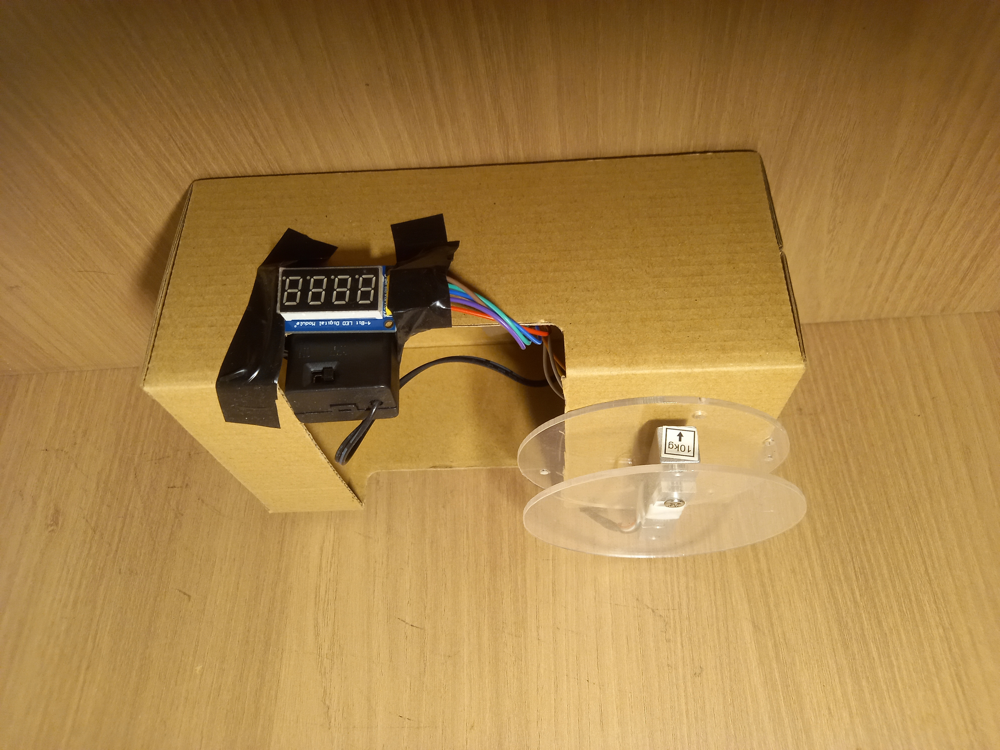
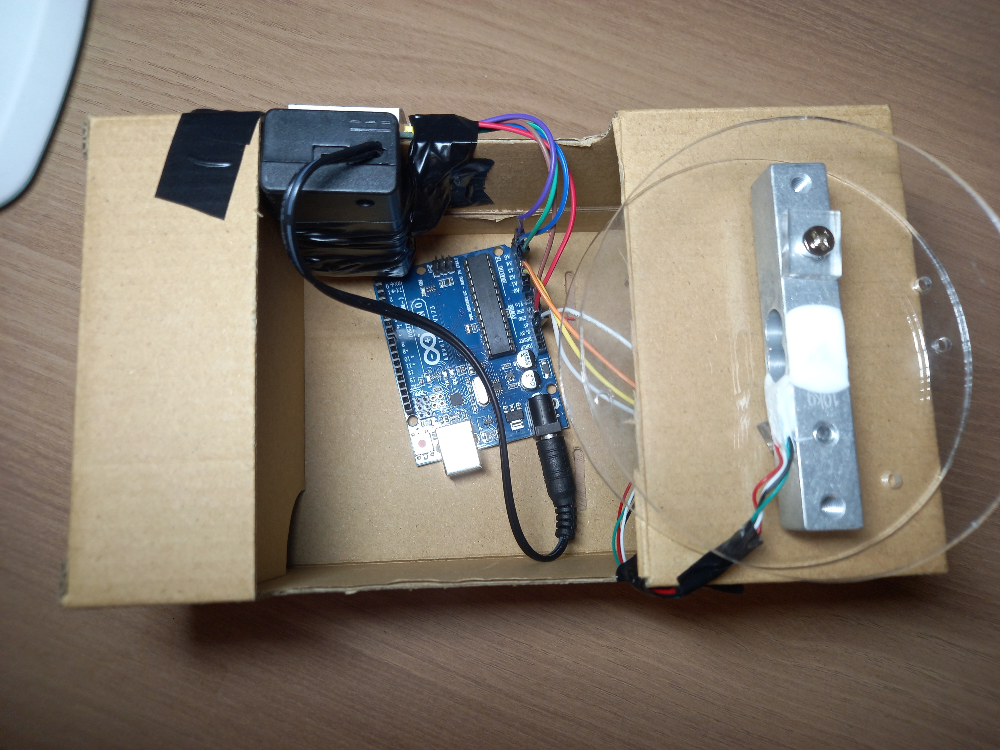
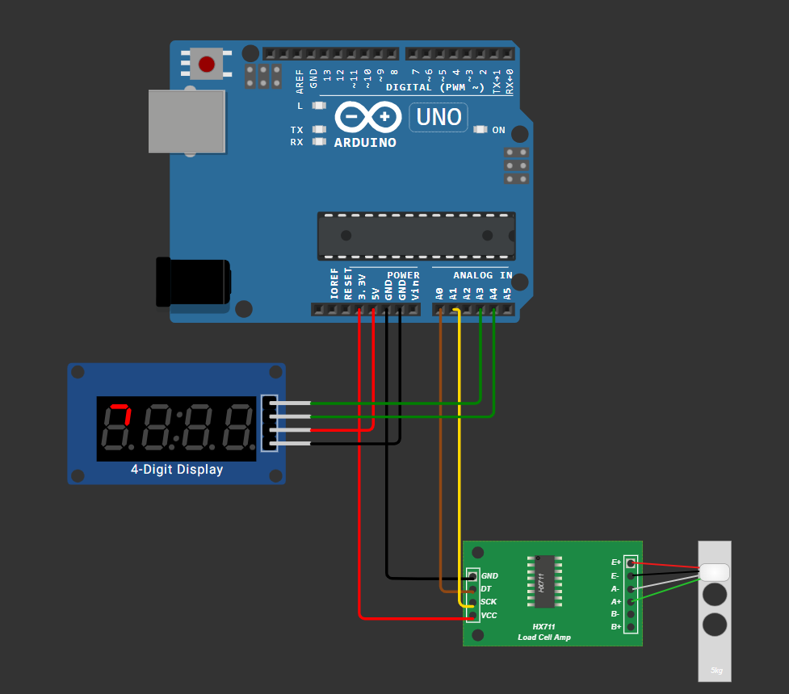
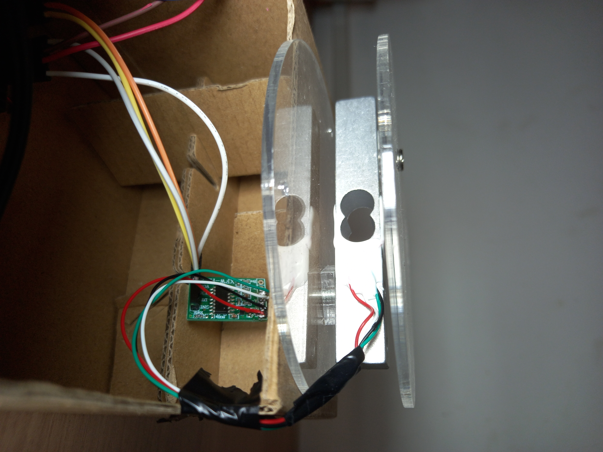
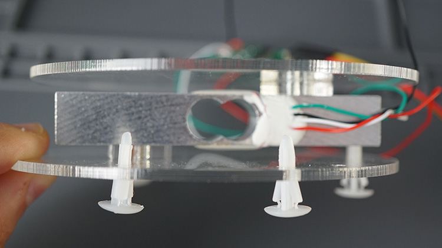
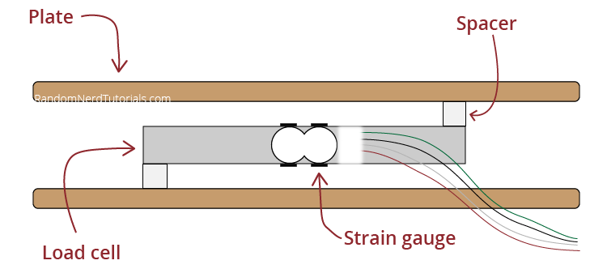
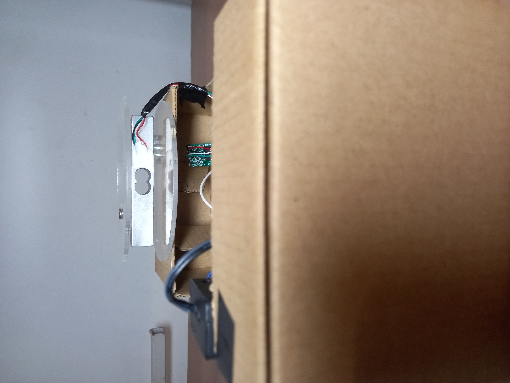
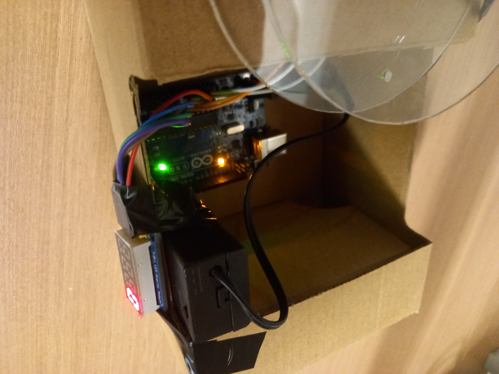

<h1 align="center">Digital Weigh Scale — Project Report</h1>

<p align="center">
  <b>Course:</b> Electrical Instrumentation and Measurement<br>
  <b>Instructor:</b> Dr. Vo Bich Hien
</p>

<p align="center">
  <b>Authors:</b><br>
  Nguyen Hoang Long — ID: 10223088<br>
  Vu Hoang Minh — ID: 102240574
</p>

---

## Contents
- [1. Introduction](#1-introduction)
- [2. System Overview](#2-system-overview)
  - [2.1 Functional Blocks](#21-functional-blocks)
  - [2.2 Features](#22-features)
- [3. Theory of Operation](#3-theory-of-operation)
  - [3.1 Load Cell (Wheatstone Bridge)](#31-load-cell-wheatstone-bridge)
  - [3.2 HX711 24-bit ADC + PGA](#32-hx711-24-bit-adc--pga)
  - [3.3 4-Digit Display via 74HC595](#33-4-digit-display-via-74hc595)
- [Wiring](#wiring)
- [Build notes (mechanical)](#build-notes-mechanical)
- [Firmware](#firmware)
- [Calibration & tare](#calibration--tare)
- [Testing & results](#testing--results)
- [Troubleshooting](#troubleshooting)
- [Limitations & improvements](#limitations--improvements)
- [Repository structure](#repository-structure)
- [License](#license)
- [Media gallery](#media-gallery)

---

## 1. Introduction

This **digital weigh scale** was proposed by Dr. Vo Bich Hien as a mini project for the *Electrical Instrumentation and Measurement* course (ECE2024). In doing this project we gain hands-on experience and a broader perspective of practical measurement systems.

Digital weighing systems are widely used in retail, industrial automation, and laboratories. A common approach is to use a **load cell** (strain-gauge bridge) that converts force into a small differential voltage, then digitize it using a high-resolution ADC such as the **HX711**. The Arduino processes the readings and drives a numeric display.

This mini project focuses on:
- interfacing a load cell sensor,
- precision ADC sampling using the HX711,
- real-time numeric display using a multiplexed 7-segment module,
- implementing tare and calibration procedures.

<p align="center">
  
</p>

---

## 2. System Overview

### 2.1 Functional blocks

```
Force / Weight
|
▼
Load Cell (Wheatstone Bridge)
| (mV/V differential signal)
▼
HX711 24-bit ADC + PGA
| (digital data)
▼
Arduino Uno (processing, tare, calibration)
|------------------> Serial Monitor (g=<value>, commands)
▼
4-Digit 7-Segment Display (74HC595 shift registers)
```

### 2.2 Features

- Live weight readout in **grams**.
- 4-digit display range **0 → 9999 g** (values are clamped).
- Serial output every ~100 ms: `g=<value>`.
- Simple serial commands:
  - `t` → tare (zero)
  - `c <grams>` → calibrate using a known mass

---

## 3. Theory of Operation

### 3.1 Load Cell (Wheatstone Bridge)

A typical bar-type load cell contains strain gauges configured as a **Wheatstone bridge**. When force is applied, the bridge becomes unbalanced, producing a small differential output voltage (often only millivolts). This signal is too small to measure accurately using the Arduino’s built-in ADC without amplification.

### 3.2 HX711 24-bit ADC + PGA

The HX711 is designed for weigh scales and provides:
- a low-noise **PGA** (to amplify the bridge signal),
- a **24-bit ADC** to digitize the amplified signal,
- a simple two-wire interface: **DOUT (DT)** and **SCK**.

### 3.3 4-Digit Display via 74HC595

The 4-digit 7-segment display is driven through **74HC595 shift registers**, which reduces the Arduino I/O requirement to three lines:
- Data (DIO)
- Shift clock (SCLK)
- Latch clock (RCLK)

The display is refreshed continuously in software (multiplexing).

---

## Hardware

### Bill of Materials (BOM)

- Arduino Uno (or compatible)
- Bar-type strain gauge **load cell** (project platform label shows **10 kg**)
- **HX711** load-cell amplifier/ADC module
- 4-digit 7-segment LED module (74HC595 driver)
- Platform plates (acrylic), standoffs/spacers, fasteners
- Jumper wires, enclosure material (cardboard in this build)

<p align="center">
  
  <br/>
  <em>Internal layout: Arduino + HX711 + wiring routed to the platform and display.</em>
</p>

---

## Wiring

### Pin mapping (matches the firmware)

From [`Source Code/digital_weigh_scale.ino`](Source%20Code/digital_weigh_scale.ino):

- `HX711_ADC LoadCell(A0, A1);`  → **DOUT/DT = A0**, **SCK = A1**
- `Led4digit74HC595 disp(A5, A4, A3);` → **SCLK = A5**, **RCLK = A4**, **DIO = A3**

| Module | Signal | Arduino Uno |
|---|---|---:|
| HX711 | DT (DOUT) | A0 |
| HX711 | SCK | A1 |
| 4-digit display | DIO | A3 |
| 4-digit display | RCLK (latch) | A4 |
| 4-digit display | SCLK (shift clk) | A5 |
| HX711 + display | VCC | 5V |
| HX711 + display | GND | GND |

### Schematic

<p align="center">
  
  <br/>
  <em>Arduino Uno ↔ HX711 ↔ load cell, plus 4-digit display (74HC595).</em>
</p>

### Load cell wiring notes

Load cell wire colors vary. A common convention is:

- **Red = E+**, **Black = E−** (excitation)
- **Green = A+**, **White = A−** (signal)

Always verify against your load cell’s label or the HX711 board markings.

<p align="center">
  
  <br/>
  <em>Load cell + HX711 wiring inside the enclosure (close-up).</em>
</p>

---

## Build notes (mechanical)

Bar load cells measure bending. The platform must apply force so the sensing region flexes consistently.

**Practical tips used in this build**

- Keep the base plate rigid; avoid wobble.
- Apply the load near the platform center.
- Avoid preloading the beam by over-tightening one side.
- Route sensor wires so they are not tugging the load cell.

Reference layouts:

<p align="center">
  
  <br/>
  <em>Example mounting between top/bottom plates.</em>
</p>

<p align="center">
  
  <br/>
  <em>Recommended spacer/standoff arrangement to let the beam flex.</em>
</p>

Additional views of the platform/load cell used:

<p align="center">
  
  <br/>
  <em>Side view: acrylic platform plates and bar-type load cell placement.</em>
</p>

---

## Firmware

### Dependencies

Two Arduino libraries are included as ZIPs in `Libraries/`:

- `HX711_ADC-master.zip`
- `Led4digit74HC595-master.zip`

**Arduino IDE install:** *Sketch → Include Library → Add .ZIP Library…* (add both ZIPs), then open and upload:

- `Source Code/digital_weigh_scale.ino`

### Runtime behavior

- The display is refreshed continuously (`disp.loopShow()`), while the HX711 is updated (`LoadCell.update()`).
- Every ~100 ms the firmware:
  - reads grams (`LoadCell.getData()`),
  - rounds to an integer,
  - clamps to **0…9999**,
  - prints `g=<grams>` over Serial,
  - updates the 4-digit display.

<p align="center">
  
  <br/>
  <em>System running (Arduino powered, display active).</em>
</p>

---

## Calibration & tare

Open **Serial Monitor** at **115200 baud**.

### Tare

- Command: `t`
- Effect: sets the current platform load as zero.

### Calibration

- Command: `c <grams>` (example: `c 205`)
- Steps:
  1. Tare the empty platform (`t`).
  2. Place a known mass.
  3. Send `c <known_mass_in_grams>`.

The sketch updates the calibration factor using a ratio:

$$
calFactor_{new} = calFactor_{old} \times \frac{measured}{real}
$$

> The updated factor is applied immediately, but it is **not saved permanently**. If you want it to persist, copy the printed value into `calFactor` in the sketch (or store it in EEPROM as an upgrade).

### Display range / clamping

Because the display has 4 digits:

- Values `< 0` display as `0`
- Values `> 9999` display as `9999`

<p align="center">
  
  <br/>
  <em>Example: values above the range are clamped to 9999 g.</em>
</p>

---

## Testing & results

Two test videos are included in the repository:

- [Testing.mp4](Media/Testing.mp4) — final product with enclosure
- [Testing 2.mp4](Media/Testing%202.mp4) — barebone prototype

---

## Troubleshooting

- **Reading is negative or unstable**
  - Re-check load cell wiring order on HX711 (A+/A− swapped can invert sign).
  - Ensure the load cell is mounted so it can flex (no binding).
  - Shorten sensor wires or twist pairs to reduce noise.

- **Always shows 0 or doesn’t change**
  - Confirm HX711 pins: DT → A0, SCK → A1.
  - Confirm HX711 has power (VCC/GND).
  - Make sure the load cell is actually stressed (platform isn’t bottoming out).

- **Display not updating / flickering**
  - Confirm display pins: DIO → A3, RCLK → A4, SCLK → A5.
  - Check that `disp.loopShow()` is called frequently (it is in `loop()`).

---

## Limitations & improvements

**Current limitations**

- Calibration factor is not saved across resets.
- Display limited to **0–9999 g**.
- Mechanical rigidity and vibration strongly affect repeatability.

**Suggested improvements**

- Store calibration and tare offset in **EEPROM**.
- Add digital filtering (moving average / median) and a stability indicator.
- Add push buttons for **tare** and **calibrate** (standalone operation).
- Improve enclosure/platform rigidity for better repeatability.

---

## Repository structure

- `Source Code/`
  - `digital_weigh_scale.ino` — Arduino sketch
- `Libraries/`
  - `HX711_ADC-master.zip`
  - `Led4digit74HC595-master.zip`
- `Media/`
  - Photos + schematic + test videos

---

## License

MIT — see [LICENSE](LICENSE).

---
